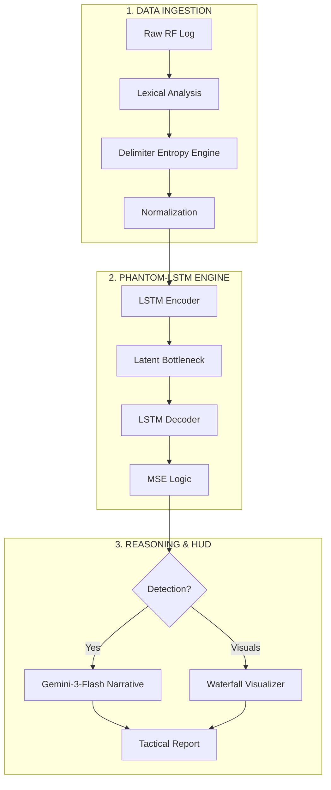

# PhantomBand: Recurrent RF Intelligence

PhantomBand is a state-of-the-art Signals Intelligence (SIGINT) and Electronic Warfare (EW) analysis platform. It ingests raw Radio Frequency (RF) logs to identify sophisticated threats—such as LPI (Low Probability of Intercept) signals and GNSS spoofing—that bypass traditional threshold-based detection. By operating entirely within the browser, it ensures maximum data sovereignty while providing high-fidelity tactical awareness.

### The Model: Phantom-LSTM
At the core of PhantomBand is the **Phantom-LSTM**, a Deep-Temporal Recurrent Autoencoder. Unlike standard FFT analysis which provides static snapshots, this model learns the temporal "physics" of an environment. By training on a baseline of normal environmental noise, it identifies **Spectral Reconstruction Errors (SRE)**. If a signal violates the learned temporal consistency of the background, the model’s reconstruction delta—measured via **Mean Squared Error (MSE)**—spikes, triggering an anomaly detection. This allows for the identification of coherent signals even when they are hidden near the noise floor.

---

### System Architecture

<b>Figure 1: PhantomBand Intelligence & Detection Pipeline</b>

The architecture leverages a local-first data flow. Signal data is sanitized and normalized before entering the hardware-accelerated LSTM core. The engine establishes a temporal baseline, and any deviations are categorized as anomalies. These mathematical deviations are then interpreted by the Gemini-3-Flash reasoning engine to produce a human-readable tactical narrative, synchronized with the spectrum visualizer.

---

### Tech Stack
- **Framework**: React 19 (Modern ES6 Modules)
- **ML Engine**: TensorFlow.js (Recurrent LSTM Autoencoder)
- **Reasoning**: Google Gemini API (`gemini-3-flash-preview`)
- **Visualization**: Recharts & High-Density Custom SVG
- **Styling**: Tailwind CSS (Tactical HUD Theme)
- **Parsing**: Heuristic Lexical Analyzer with Delimiter Entropy

---

### Detailed Setup Instructions

1.  **Environment Preparation**:
    - Use a browser with **WebGL/WebGPU** support (Chrome/Edge/Safari) for LSTM acceleration.
    - Ensure your environment has the `API_KEY` variable configured for the Google GenAI SDK.

2.  **Input Data Requirements**:
    - Prepare spectrum logs in `.csv` or `.txt` format.
    - Files should contain at least two numeric columns (Frequency and Power).
    - Data from RTL-SDR, HackRF, or professional spectrum analyzers is fully supported.

3.  **Deployment**:
    - Navigate to the project root.
    - Install dependencies using `npm install`.
    - Launch the application with `npm start` and access via the provided localhost URL.

4.  **Operational Workflow**:
    - **Upload**: Drag your RF log into the "UPLOAD FILE" zone.
    - **Calibration**: Adjust the **Analysis Timesteps** (temporal depth) and **Detection Sensitivity** (MSE threshold) sliders.
    - **Targeting**: Select a **Primary Detection Target** (e.g., Drone C2 Link Detection) to guide the AI's reasoning.
    - **Execution**: Click **START SIGINT SCAN**. The system will train the model and generate a narrative intelligence report within seconds.

---
**Note**: This tool is intended for authorized SIGINT research and defensive EW operations only.