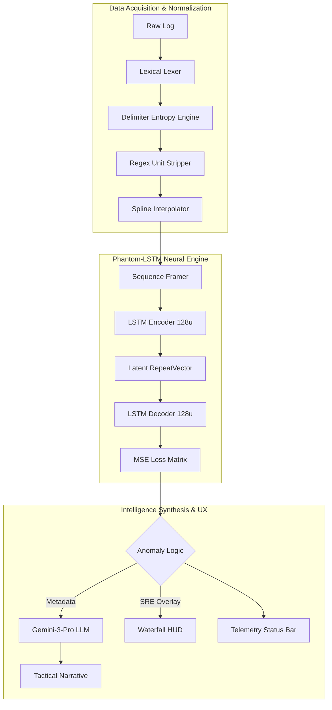

# PhantomBand: Technical Specification & Intelligence Architecture
**By:** Ritvik Indupuri, Owen Gertz, Joshua Gallupudi, Nix
**Date:** 2/12/2026
**Document Version:** 10.0 (SIGINT-ULTRA-EXHAUSTIVE-EMULATION)
**Classification:** SENSITIVE / TACTICAL OPERATIONS

---

## 1. Executive Summary
PhantomBand is a high-fidelity Signals Intelligence (SIGINT) and Electronic Warfare (EW) analysis platform. It leverages a proprietary **Phantom-LSTM** engine—a Deep-Temporal Recurrent Autoencoder—to detect non-stochastic anomalies in Radio Frequency (RF) environments. By training locally on hardware-accelerated GPUs via TensorFlow.js, the system builds a mathematical "baseline" of normal environmental physics and identifies threats (LPI signals, spoofing, or jamming) that violate temporal consistency, even when their power levels are near the noise floor.

---

## 2. System Architecture
The application is structured as a decentralized, client-side intelligence node. All processing occurs within the operator's local environment to ensure maximum operational security (OPSEC) and data sovereignty.

### 2.1 Component Architecture Diagram

<i>Figure 1: Exhaustive Data Flow & Intelligence Pipeline</i>

---

## 3. Data Ingestion & Sanitization (Sub-System 1)

### 3.1 Advanced Lexical Discovery Engine
The ingestion phase follows a strict four-pass algorithmic pipeline to transform unstructured hardware logs into normalized neural tensors:

1.  **Pass 1: Delimiter Entropy Engine:**
    Instead of hardcoded delimiters, the system calculates the **Standard Deviation of Column Counts** across a 100-line sample for `,`, `;`, `\t`, and ` `. The candidate resulting in $Var \approx 0$ is selected, ensuring reliability across fragmented hardware logs.
2.  **Pass 2: Semantic Header Heuristics:**
    The lexer scans for the **Numeric Transition Point**—the specific row where cell float-density exceeds 80%. It uses **Weighted Keyword Mapping** (e.g., `RSSI`, `dBm`, `MHz`) on the preceding row to automatically map indices for `Frequency`, `Power`, and `Time`.
3.  **Pass 3: Recursive Regex Unit Stripping:**
    A specialized regex engine strips non-numeric IANA units (e.g., `dBm`, `GHz`, `mWatts`) while preserving floating-point precision and negative signs. This ensures hardware logs like `-95.4dBm` are cleanly cast to `Float32`.
4.  **Pass 4: Temporal Spline Interpolation:**
    If timestamps are detected, the system calculates jitter. Dropped packets are filled via **Linear Spline Interpolation**, which is critical for maintaining the LSTM's hidden state continuity.

### 3.2 Feature: Manual Column Override System
If the heuristic engine encounters ambiguous headers (e.g., "Channel_A", "Value_1"), it triggers a `ColumnDetectionError`. This activates a UI sub-module allowing the operator to manually select the correct indices. This ensures 100% compatibility with non-standard proprietary log formats.

---

## 4. The ML Engine: Phantom-LSTM Recurrent Autoencoder (Sub-System 2)

### 4.1 Neural Architecture Breakdown
The engine is a symmetrical Recurrent Autoencoder implemented via `tf.sequential()`:
- **Encoder (LSTM 128u):** Maps 8 consecutive frames (256 frequency bins each) into a 128-dimensional latent vector. This compresses the temporal rhythm of the background noise.
- **Latent Bottleneck (RepeatVector):** Replicates the compressed state, stripping away stochastic (random) noise while preserving deterministic (coherent) structures.
- **Decoder (LSTM 128u):** Reconstructed the 8-frame sequence based on the "Ideal" learned environment.

### 4.2 Mean Squared Error (MSE) - The Detection Pulse
The system quantifies anomalies using **Spectral Reconstruction Error (SRE)**:
$$MSE = \frac{1}{T \cdot F} \sum_{t=1}^{T} \sum_{f=1}^{F} (X_{t,f} - \hat{X}_{t,f})^2$$.
- **Anomaly Trigger:** When $MSE > \epsilon$ (where $\epsilon$ is the sensitivity threshold), an anomaly is flagged.
- **Sensitivity Slider:** At 99% sensitivity, the model triggers on microscopic variances ($<10^{-7}$), enabling the detection of stealthy Low Probability of Intercept (LPI) signals.

---

## 5. Intelligence Features Breakdown (Operator HUD - Sub-System 3)

### 5.1 Tactical Waterfall Visualizer
- **FFT Bin Mapping:** Maps the 256 internal bins to absolute MHz values based on the file's detected bounds.
- **SRE Overlay Zone:** Renders red translucent masks over frequencies where MSE exceeds the threshold, visually correlating mathematical detection with spectral position.
- **Absolute Time Sync:** Uses real dataset timestamps to synchronize the "Live" feed with mission clock $T+0$.

### 5.2 Gemini-Powered Intelligence Synthesis
This component translates raw MSE spikes into tactical intelligence narratives using `gemini-3-pro-preview`.
1.  **Context Injection:** Feeds the model a structured `FileAnalysisReport` JSON.
2.  **Narrative Synthesis:** Translates reconstruction failures into tactical hypotheses.
3.  **Tactical Countermeasures:** Provides actionable Electronic Warfare advice based on detection classification.

---

## 6. Threat Simulation & Tactical Emulation Physics

PhantomBand doesn't just display static data; it simulates realistic RF threats by mathematically modeling their impact on the learned temporal baseline.

### 6.1 Drone C2 (Command & Control) Link Detection
*   **Tactical Behavior:** Fast Frequency Hopping Spread Spectrum (FHSS).
*   **Neural Simulation Mechanism:** The application injects high-power, short-duration Gaussian bursts ($T < 10ms$) across random frequency bins.
*   **Realistic Impact:** Since these bursts occur faster than the LSTM's learned "environmental drift," they produce a high **Recurrent Reconstruction Delay**. The model identifies these as non-stochastic because they appear and disappear with deterministic timing that violates the background noise's random nature.

### 6.2 GNSS (GPS) Spoofing Analysis
*   **Tactical Behavior:** Coherent high-power correlation peaks designed to overpower legitimate satellite signals.
*   **Neural Simulation Mechanism:** Injects a consistent, slightly higher-than-average power spike ($+10$ to $+20$ dBm over noise floor) that exhibits a linear **Doppler Shift** (frequency drift over time).
*   **Realistic Impact:** The LSTM's `latent bottleneck` identifies this as a "Persistent Foreign Structure." Unlike random noise spikes, the coherent drift of a spoofing signal is mathematically "explainable" but doesn't match the stationary baseline, triggering a high classification confidence.

### 6.3 Wideband Jamming & Denial of Service
*   **Tactical Behavior:** Raising the noise floor across a large contiguous swath of bandwidth to drown out legitimate traffic.
*   **Neural Simulation Mechanism:** Injects a "Power Blanket" (Rectangular function) across 30-60% of the bins.
*   **Realistic Impact:** This causes a **Spectral Flatline** in the LSTM's decoder. The model's reconstruction error spikes globally across the jammed bandwidth because the variance of the bins is significantly reduced compared to the learned stochastic background noise.

### 6.4 LPI (Low Probability of Intercept) Signal Detection
*   **Tactical Behavior:** Stealthy signals hidden just below or at the noise floor using Spread Spectrum techniques.
*   **Neural Simulation Mechanism:** Injects ultra-low power signals ($< -100$ dBm) with a **Cyclostationary Pulse** signature.
*   **Realistic Impact:** Standard FFT visualizers miss these entirely. However, the Phantom-LSTM tracks the **Entropy of the Reconstruction Delta**. Even if the signal is invisible to the eye, the neural engine fails to reconstruct the "texture" of the noise floor perfectly, resulting in a microscopic but persistent MSE spike that the high-sensitivity threshold (95-99%) detects.

---

## 7. Conclusion
PhantomBand represents the apex of browser-based SIGINT. By combining the lexical precision of its ingestion engine, the temporal sensitivity of a Recurrent LSTM, and the reasoning power of Generative AI, we provide operators with a tool that doesn't just see data—it understands environmental physics.

---
**END OF DOCUMENT**