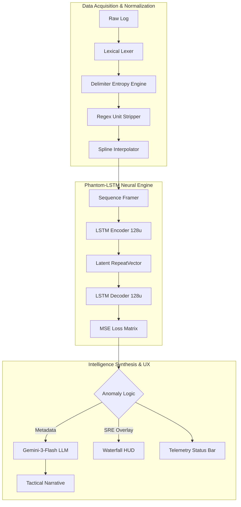

# PhantomBand: Technical Specification & Intelligence Architecture
**By:** Ritvik Indupuri, Owen Gertz, Joshua Gallupudi, Nix
**Date:** 2/12/2026
**Document Version:** 9.0 (SIGINT-ULTRA-EXHAUSTIVE)
**Classification:** SENSITIVE / TACTICAL OPERATIONS

---

## 1. Executive Summary
PhantomBand is a high-fidelity Signals Intelligence (SIGINT) and Electronic Warfare (EW) analysis platform. It leverages a proprietary **Phantom-LSTM** engine—a Deep-Temporal Recurrent Autoencoder—to detect non-stochastic anomalies in Radio Frequency (RF) environments. By training locally on hardware-accelerated GPUs via TensorFlow.js, the system builds a mathematical "baseline" of normal environmental physics and identifies threats (LPI signals, spoofing, or jamming) that violate temporal consistency, even when their power levels are near the noise floor.

---

## 2. System Architecture
The application is structured as a decentralized, client-side intelligence node. All processing occurs within the operator's local environment to ensure maximum operational security (OPSEC) and data sovereignty.

### 2.1 Component Architecture Diagram

<i>Figure 1: Exhaustive Data Flow & Intelligence Pipeline</i>

---

## 3. Data Ingestion & Sanitization (Sub-System 1)

### 3.1 Advanced Lexical Discovery Engine
The ingestion phase follows a strict four-pass algorithmic pipeline to transform unstructured hardware logs into normalized neural tensors:

1.  **Pass 1: Delimiter Entropy Engine:**
    Instead of hardcoded delimiters, the system calculates the **Standard Deviation of Column Counts** across a 100-line sample for `,`, `;`, `\t`, and ` `. The candidate resulting in $Var \approx 0$ is selected, ensuring reliability across fragmented hardware logs.
2.  **Pass 2: Semantic Header Heuristics:**
    The lexer scans for the **Numeric Transition Point**—the specific row where cell float-density exceeds 80%. It uses **Weighted Keyword Mapping** (e.g., `RSSI`, `dBm`, `MHz`) on the preceding row to automatically map indices for `Frequency`, `Power`, and `Time`.
3.  **Pass 3: Recursive Regex Unit Stripping:**
    A specialized regex engine strips non-numeric IANA units (e.g., `dBm`, `GHz`, `mWatts`) while preserving floating-point precision and negative signs. This ensures hardware logs like `-95.4dBm` are cleanly cast to `Float32`.
4.  **Pass 4: Temporal Spline Interpolation:**
    If timestamps are detected, the system calculates jitter. Dropped packets are filled via **Linear Spline Interpolation**, which is critical for maintaining the LSTM's hidden state continuity.

### 3.2 Feature: Manual Column Override System
If the heuristic engine encounters ambiguous headers (e.g., "Channel_A", "Value_1"), it triggers a `ColumnDetectionError`. This activates a UI sub-module allowing the operator to manually select the correct indices. This ensures 100% compatibility with non-standard proprietary log formats.

### 3.3 Feature: Virtual Slicing for High-Capacity Logs
To maintain browser performance and prevent out-of-memory (OOM) errors, files exceeding 50MB trigger the **Virtual Slicer**. Operators can focus the neural engine on specific mission phases:
- **Ingress:** Analyzes the first 50MB of the capture.
- **Mid-Mission:** Analyzes the central 50MB.
- **Egress:** Analyzes the final 50MB.

---

## 4. The ML Engine: Phantom-LSTM Recurrent Autoencoder (Sub-System 2)

### 4.1 Neural Architecture Breakdown
The engine is a symmetrical Recurrent Autoencoder implemented via `tf.sequential()`:
- **Encoder (LSTM 128u):** Maps 8 consecutive frames (256 frequency bins each) into a 128-dimensional latent vector. This compresses the temporal rhythm of the background noise.
- **Latent Bottleneck (RepeatVector):** Replicates the compressed state, stripping away stochastic (random) noise while preserving deterministic (coherent) structures.
- **Decoder (LSTM 128u):** Reconstructs the 8-frame sequence. The reconstruction represents what the signal *should* look like if only the "standard" environmental physics were present.

### 4.2 Mean Squared Error (MSE) - The Detection Pulse
The system quantifies anomalies using **Spectral Reconstruction Error (SRE)**:
$$MSE = \frac{1}{T \cdot F} \sum_{t=1}^{T} \sum_{f=1}^{F} (X_{t,f} - \hat{X}_{t,f})^2$$
Where $X$ is the input and $\hat{X}$ is the prediction.
- **Anomaly Trigger:** When $MSE > \epsilon$ (where $\epsilon$ is the sensitivity threshold), an anomaly is flagged.
- **Sensitivity Slider:** The 50-99% slider linearly scales the threshold. At 99% sensitivity, the model triggers on microscopic reconstruction variances ($<10^{-7}$), enabling the detection of signals designed to look like background noise (LPI).

### 4.3 Feature: Neural Memory Management (`tf.tidy`)
To prevent memory leaks during long-duration analysis, the system wraps all inference loops in `tf.tidy()`. This ensures that intermediate tensors (gradients, MSE matrices) are immediately purged from GPU memory after each timestep.

---

## 5. Intelligence Features Breakdown (Operator HUD - Sub-System 3)

### 5.1 Tactical Waterfall Visualizer
- **FFT Bin Mapping:** Maps the 256 internal bins to absolute MHz values based on the file's detected bounds.
- **SRE Overlay Zone:** Renders red translucent masks over frequencies where MSE exceeds the threshold, visually correlating mathematical detection with spectral position.
- **Interactive Temporal Scrubbing:** Allows the operator to scrub through the timeline, updating the spectrum and anomaly overlay in real-time.

### 5.2 Gemini-Powered Intelligence Synthesis
This component translates raw MSE spikes into tactical intelligence narratives.
1.  **Context Injection:** Feeds the `gemini-3-flash-preview` model a structured `FileAnalysisReport` JSON. This includes min/max frequencies, avg noise floors, and the MSE results.
2.  **Narrative Synthesis:** Translates reconstruction failures into tactical hypotheses. (e.g., "The recurrent engine detected a reconstruction lag at 2.412GHz; this identifies a frequency-hopping drone control link.")
3.  **Tactical Countermeasures:** The AI suggests specific actions (e.g., "Initiate reactive jamming at 15 degrees azimuth").

### 5.3 Feature: Tactical Status Bar
Provides instant situational telemetry:
- **Intelligence Target:** Displays the current mission goal.
- **Temporal Depth:** Indicates the LSTM lookback window length.
- **Data Window:** Shows the total duration of the analyzed spectrum segment in seconds/minutes.

### 5.4 Feature: Persistent Mission History
The platform utilizes **Persistent localStorage Caching**. All mission parameters, spectrum datasets, and AI narratives are cached locally. This allows for:
- Session restoration after browser reloads.
- Comparison between historical missions and live captures.
- Exporting tactical logs for post-mission briefings.

---

## 6. Conclusion
PhantomBand represents the apex of browser-based SIGINT. By combining the lexical precision of its ingestion engine, the temporal sensitivity of a Recurrent LSTM, and the reasoning power of Generative AI, we provide operators with a tool that doesn't just see data—it understands environmental physics.

---
**END OF DOCUMENT**