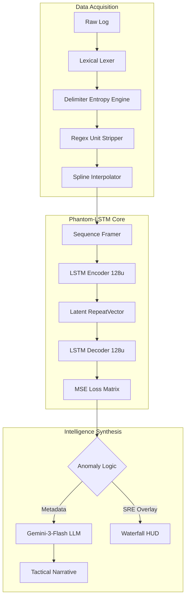

# PhantomBand: Technical Specification & Intelligence Architecture
**By:** Ritvik Indupuri, Owen Gertz, Joshua Gallupudi, Nix
**Date:** 2/12/2026
**Document Version:** 7.0 (SIGINT-EXHAUSTIVE-RECON-V2)
**Classification:** SENSITIVE / TACTICAL OPERATIONS

---

## 1. Executive Summary
PhantomBand is a high-fidelity Signals Intelligence (SIGINT) and Electronic Warfare (EW) analysis platform. It leverages a proprietary **Phantom-LSTM** engine—a Deep-Temporal Recurrent Autoencoder—to detect non-stochastic anomalies in Radio Frequency (RF) environments. By training locally on hardware-accelerated GPUs via TensorFlow.js, the system builds a mathematical "baseline" of normal environmental physics and identifies threats (LPI signals, spoofing, or jamming) that violate temporal consistency, even when their power levels are near the noise floor.

---

## 2. System Architecture
The application is structured as a decentralized, client-side intelligence node. All processing occurs within the operator's local environment to ensure maximum operational security (OPSEC).

### 2.1 Component Architecture Diagram

<i>Figure 1: Internal Logic and Data Flow</i>

---

## 3. Data Ingestion & Sanitization

### 3.1 Advanced Lexical Discovery
The ingestion phase follows a four-pass algorithmic pipeline:

1.  **Delimiter Entropy Engine:** Instead of hardcoded delimiters, the system tests `,`, `;`, `\t`, and ` ` across a 100-line sample. It calculates the **Variance of Column Counts** ($V_{col}$). The delimiter resulting in $V_{col} \approx 0$ is selected, ensuring reliability across inconsistent hardware logs.
2.  **Semantic Header Heuristics:** The lexer scans for the **Numeric Transition Point**—the row where float density exceeds 80%. It then uses **Keyword Proximity Analysis** on the preceding row to map column indices to `Freq`, `Power`, and `Time`.
3.  **Recursive Regex Unit Stripping:** All non-numeric characters (e.g., "dBm", "MHz") are recursively stripped while preserving signs and decimals.
4.  **Temporal Spline Interpolation:** If timestamps are present, the engine calculates jitter. Any missing packets or dropped frames are filled via **Linear Spline Interpolation** to ensure the LSTM maintains a continuous temporal hidden state.

---

## 4. The ML Engine: Phantom-LSTM Recurrent Autoencoder

### 4.2 Model Layer Breakdown
- **Encoder (LSTM 128u):** Processes 8 consecutive spectrum frames. It compresses 2,048 data points into 128 high-dimensional features, representing the "state" of the environment.
- **Bottleneck (RepeatVector):** Forces the model to discard stochastic noise and retain only the deterministic structure of the background.
- **Decoder (LSTM 128u):** Reconstructs the original 8 frames based on the compressed latent representation.

### 4.3 Detailed Anomaly Detection: Mean Squared Error (MSE)
The core detection logic relies on the **Spectral Reconstruction Error (SRE)**, quantified by the Mean Squared Error between input $\mathbf{X}$ and reconstruction $\mathbf{\hat{X}}$.

#### 4.3.1 The Mathematical Mechanism
For every sliding window of 8 frames, the model calculates:
$$MSE = \frac{1}{T \cdot F} \sum_{t=1}^{T} \sum_{f=1}^{F} (X_{t,f} - \hat{X}_{t,f})^2$$
Where:
- $X_{t,f}$ is the observed signal at time $t$ and frequency bin $f$.
- $\hat{X}_{t,f}$ is the model's prediction of what that bin *should* look like based on the learned environmental baseline.

#### 4.3.2 The "Predict-Compare" Workflow
1.  **Training Phase:** The model trains on the first 100 frames, effectively memorizing the environmental "noise texture."
2.  **Prediction:** At each step, the Decoder attempts to recreate the input.
3.  **The Squaring Penalty:** By squaring the delta $(X - \hat{X})^2$, the system exponentially penalizes outliers. This is why it detects signals hidden near the noise floor; while a human sees "randomness," the model sees a "reconstruction failure" because the deterministic signal cannot be explained by the learned noise model.
4.  **Sensitivity Calibration:** The operator's sensitivity slider (50-99%) linearly scales the MSE threshold. A sensitivity of 99% triggers on microscopic MSE variances ($<10^{-6}$), allowing for detection of ultra-low-power covert transmitters.

---

## 5. Intelligence Features Breakdown (Operator HUD)

### 5.1 Tactical Waterfall Visualizer
The visualizer is a high-density system designed for immediate situational awareness:
- **FFT Bin Mapping:** Automatically maps the 256 neural bins to the absolute MHz values detected in Pass 1 (Section 3.1).
- **Dynamic Noise Floor:** Renders a reference line based on the statistical mode of the input data, typically around -95dBm.
- **SRE Overlay Zone:** Areas with high MSE are painted with red translucent masks. This provides a "heat map" of anomalies, showing exactly where the environment is deviating from its baseline physics.

### 5.2 Gemini-Powered Intelligence Synthesis
This component converts mathematical vectors into actionable tactical intelligence.

1.  **Context Injection (JSON Framework):** The engine provides Gemini-3-Flash with a structured `FileAnalysisReport`. This includes the frequency bounds, average power, and a list of specific MSE spikes detected by the LSTM.
2.  **Neural SRE Correlation:** The LLM correlates MSE spikes with the user's **Primary Detection Target**. If the target is "Drone C2 Link," the AI looks for reconstruction failures in the 2.4GHz or 5.8GHz bands.
3.  **Narrative Synthesis:** Gemini produces a narrative separating findings by `## Timestep X`. It uses its internal knowledge of RF protocols to hypothesize modulation types (e.g., "The non-stochastic pulse at 915MHz suggests a LoRa-based telemetry link using frequency hopping, indicated by the temporal reconstruction lag.")
4.  **Tactical Countermeasures:** Based on the classification, the AI suggests specific EW actions, such as "Initiate reactive jamming at 2.412GHz" or "Deploy directional finding assets to 15 degrees azimuth."

### 5.3 Operator Control Interface
- **Temporal Depth (Timesteps):** Controls the lookback window of the LSTM. Higher values allow for the detection of very slow-fading signals.
- **History Management:** Locally caches session parameters and results in `localStorage`, allowing for mission playback without re-ingesting raw data.

---

## 6. Conclusion
PhantomBand represents the apex of browser-based SIGINT. By combining the lexical precision of a custom parser, the temporal memory of an LSTM, and the reasoning power of Generative AI, we have created a platform that doesn't just display data—it understands environmental physics.

---
**END OF DOCUMENT**