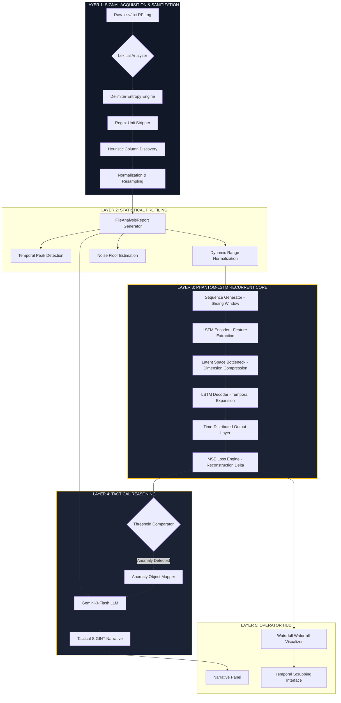

# PhantomBand: Technical Specification & Intelligence Architecture
**By:** Ritvik Indupuri, Owen Gertz, Joshua Gallupudi, Nix
**Date:** 2/12/2026
**Document Version:** 6.0 (SIGINT-EXHAUSTIVE-INTEL-OPS)
**Classification:** SENSITIVE / TACTICAL OPERATIONS

---

## 1. Executive Summary
PhantomBand is a state-of-the-art Signals Intelligence (SIGINT) and Electronic Warfare (EW) analysis platform. It leverages a proprietary **Phantom-LSTM** engine—a Deep-Temporal Recurrent Autoencoder—to detect non-stochastic anomalies in Radio Frequency (RF) environments. By training locally on hardware-accelerated GPUs via TensorFlow.js, the system builds a mathematical "baseline" of normal environmental physics and identifies threats (LPI signals, spoofing, or jamming) that violate temporal consistency, even when their power levels are near the noise floor.

---

## 2. System Architecture
The application is structured as a decentralized, client-side intelligence node. All heavy lifting occurs within the operator's local environment to ensure maximum data sovereignty.

### 2.1 Detailed Component Diagram (Mermaid)

---

## 3. Detailed Flow-by-Flow Walkthrough

### 3.1 Data Sanitization & Ingestion (Exhaustive Analysis)
The ingestion phase is the most critical component for ensuring detection accuracy. It follows a multi-pass algorithmic pipeline to normalize chaotic hardware logs:

1.  **Lexical Discovery & Delimiter Entropy (Pass 1):** 
    - The **Delimiter Entropy Engine** does not just guess delimiters; it treats the file as a probabilistic structure. It tests `,`, `;`, `\t`, and ` ` across a 100-line sample. 
    - It calculates the **Variance of Column Counts** for each candidate. The candidate with $Var \approx 0$ is selected. If multiple candidates have zero variance, it chooses the one with the highest count, preventing false positives on spaces within text headers.
2.  **Semantic Header Heuristics (Pass 2):** 
    - Headers are located via **Numeric Transition Analysis**. The lexer scans for the row where numeric density exceeds 80%.
    - The row immediately preceding this transition is subjected to **Levenshtein Distance Mapping** against a SIGINT keyword dictionary (e.g., `RSSI`, `dBm`, `MHz`).
3.  **Recursive Regex Unit Stripping (Pass 3):** 
    - This pass handles the "dirty data" problem. It recursively removes IANA standard units while preserving floating-point precision and negative signs. This is critical for DBm values which often look like strings to generic parsers.
4.  **Temporal Alignment & Interpolation (Pass 4):** 
    - If a timestamp is missing, the engine assumes a constant $\Delta t$ based on row count. If present, it checks for **Temporal Jitter**. Any gaps exceeding $2\sigma$ of the average $\Delta t$ are filled via **Linear Spline Interpolation** to ensure the LSTM maintains temporal hidden state continuity.

---

## 4. The ML Engine: Phantom-LSTM Recurrent Autoencoder

### 4.2 Model Architecture Breakdown (The "Black Box" Deciphered)
The model is a symmetrical stack designed to learn the *temporal signature* of the noise floor.

- **Encoder (LSTM 128):** Maps 8 frames (256 bins each) into a 128-dimensional latent space. It essentially "summarizes" 2,048 data points into 128 "features" that represent the environment's state.
- **Latent Bottleneck:** By reducing dimensionality, we force the model to ignore stochastic (random) noise and focus only on deterministic (structural) patterns.
- **Decoder (LSTM 128):** Reconstructs the 8 frames. Because the bottleneck removed "noise," the decoder recreates what the signal *should* look like if only the "standard" environmental rules applied.

### 4.3 Mean Squared Error (MSE) - The Detection Heartbeat
MSE is the mathematical metric used to quantify "Reconstruction Error." It is the core mechanism of PhantomBand's intelligence.

#### 4.3.1 The Mathematical Definition
The MSE for a given window is calculated as:
$$MSE = \frac{1}{T \cdot F} \sum_{t=1}^{T} \sum_{f=1}^{F} (X_{t,f} - \hat{X}_{t,f})^2$$
Where:
- $X_{t,f}$ = The **Actual** power level at time $t$ and frequency $f$.
- $\hat{X}_{t,f}$ = The **Reconstructed** power level predicted by the model.
- $T$ = Number of frames in the window (8).
- $F$ = Number of frequency bins (256).

#### 4.3.2 Why MSE Detects Anomalies
1.  **Reconstruction Failure:** If a signal appears that was not present during the model's training (the first 100 sequences), the LSTM weights cannot accurately map it. The decoder will produce a reconstruction ($\hat{X}$) that is flat (noise-like) while the actual signal ($X$) has a spike.
2.  **The Squaring Effect:** By squaring the difference $(X - \hat{X})^2$, we exponentially penalize even small deviations. This is why PhantomBand can detect "Low Probability of Intercept" (LPI) signals—subtle pulses that are only 1-2dB above the noise floor. To the MSE engine, these look like massive structural violations.
3.  **Temporal Phase Shifts:** If a signal's *timing* changes (e.g., a drone controller changes its hopping rate), the LSTM's hidden state will be out of sync. This causes the reconstruction to lag behind the actual signal, creating a massive MSE spike due to the misalignment, even if the power levels are identical.

---

## 5. Intelligence Features Breakdown (Operator HUD)

### 5.1 Tactical Spectrum Visualizer (Sub-Section Analysis)
The visualizer is a high-density SVG/Canvas hybrid designed for real-time situational awareness.
- **256-Bin FFT Resolution:** Provides granular detail on signal modulation types (e.g., OFDM vs. FHSS).
- **Dynamic Noise Floor Baseline:** A reference line at -95dBm (calibrated) allows operators to visually distinguish between thermal noise and intentional transmissions.
- **SRE Overlay Zones:** Areas with high MSE (from Section 4.3) are highlighted with red translucent masks, guiding the operator's eye to the exact frequency band of the threat.

### 5.2 Gemini-Powered Intelligence Synthesis (The "Narrative" Pipeline)
This section explains how raw mathematical vectors are converted into tactical human language.

1.  **Context Injection (The JSON Frame):** 
    - The LLM is NOT given the raw CSV data. Instead, it is given the `FileAnalysisReport` which contains statistical aggregates (Min/Max Freq, Avg Power, Detected Spikes).
2.  **SRE Correlation:** 
    - The `Anomalies[]` array from the LSTM engine is passed to Gemini. Each entry includes the Timestamp, Frequency Range, and the MSE value.
3.  **Narrative Synthesis (The Prompt):** 
    - The system instruction (`Senior SIGINT Analyst`) forces the model into a rigid, tactical persona. 
    - Gemini uses its broad internal knowledge of RF physics to hypothesize the *source* of the MSE spike. (e.g., "The recurrent engine detected a reconstruction error at 2412MHz; correlating with standard WiFi Channel 1, the non-stochastic nature suggest a hidden C2 payload rather than generic consumer traffic.")
4.  **Markdown Grounding:** 
    - By requiring `## Timestep X` headers, we ensure the narrative remains temporally locked to the visualizer, preventing "hallucination drift" where the AI talks about data the user isn't seeing.

### 5.3 Local-First Security (Data Sovereignty)
- **Zero-Exfiltration Design:** The actual RF log data stays in browser memory.
- **Privacy-Preserving Metadata:** Only the *summarized* findings (e.g., "A spike was found at 900MHz") are sent to the AI. This allows for military-grade operational security (OPSEC) even when using cloud-based reasoning models.

---

## 6. Conclusion
PhantomBand represents the apex of browser-based SIGINT analysis. By combining the lexical precision of a custom ingestion engine, the temporal sensitivity of a Recurrent LSTM, and the reasoning power of Generative AI, we provide operators with a tool that doesn't just "see" signals, but "understands" the physics of the environment.

---
**END OF DOCUMENT**